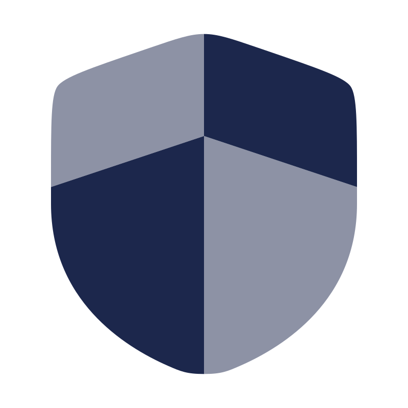
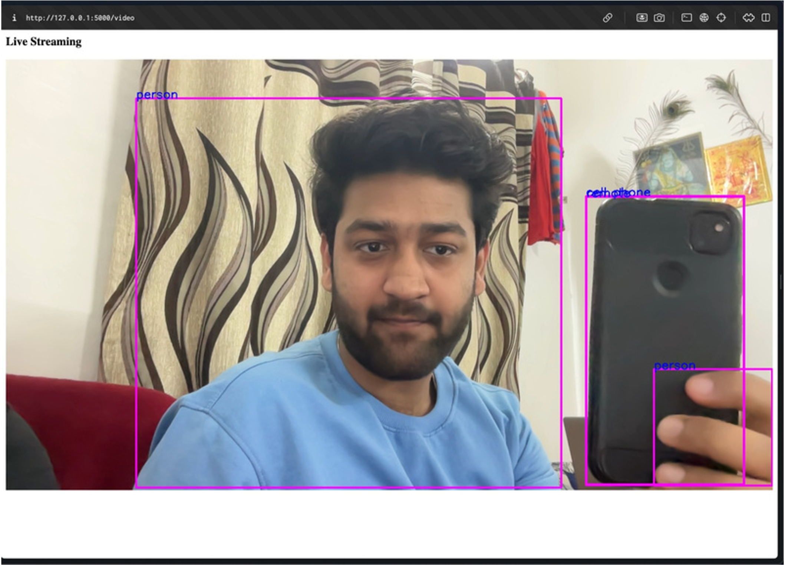
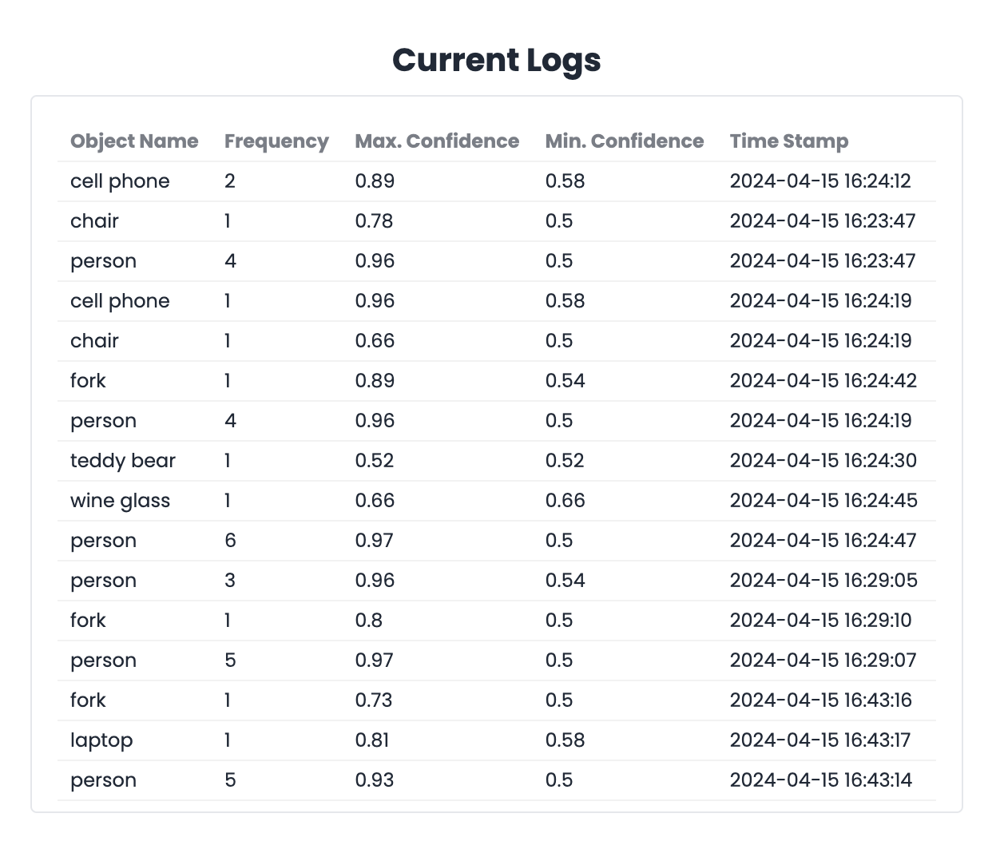

<br />
<div align="center">
  <a href="https://github.com/othneildrew/Best-README-Template">
    
  </a>

  <h3 align="center">SuRक्षा</h3>

  <p align="center">
    The ultimate AI powered Home Security and Surveillance System
  </p>
</div>

<details>
  <summary>Table of Contents</summary>
  <ol>
    <li><a href="#about-the-project">About The Project</a></li>
    <li><a href="#built-with">Built With</a></li>
    <li><a href="#getting-started">Getting Started</a></li>
    <li><a href="#prerequisites">Prerequisites</a></li>
    <li><a href="#installation">Installation</a></li>
  </ol>
</details>

## About The Project


SuRक्षा is a security system powered by AI that works with current camera systems to offer sophisticated video analytics, detect threats, and provide intelligent monitoring features. The system utilizes computer vision and deep learning methods to analyze video streams, allowing for functionalities like identifying objects, tracking motion, detecting anomalies, and recognizing fires.

<p align="right">(<a href="#readme-top">back to top</a>)</p>

### Built With

SuRक्षा is built with the following technologies:

- [![Flask][Flask.com]][Flask.com]
- [![Python][Python.com]][Python.com]
- [![Firebase][Firebase.com]][Firebase.com]
- [![Chart.js][Chart.js]][Chart.js]
- [![Yolov8][Yolov8]][Yolov8]
- [![Huggingface][Huggingface]][Huggingface]

<p align="right">(<a href="#readme-top">back to top</a>)</p>

## Getting Started

To start using SuRक्षा, follow the steps below.

### Prerequisites

You will need the following tools to get started:

- **Python** - Follow the instructions [here](https://www.python.org/downloads/) to install Python.

- **Poetry** - A tool for dependency management and packaging in Python. You can install it using the following command:

```sh
python3 -m pip install poetry
```

### Installation

1. Clone the repository either using the GitHub GUI or the following command:

```sh
cd path/to/directory
git clone https://github.com/ChiragAgg5k/suraksha
cd suraksha
```

1. Install the required dependencies using Poetry.

```sh
poetry shell
poetry install
pip install --force-reinstall -v "numpy==1.25.2" # fix some weird issue with krutrim
```

3. Create a new **Firebase** project and get the required credentials. You can follow the instructions [here](https://firebase.google.com/docs/web/setup)

4. Create a **Mailtrap** account and get the credentials for email notifications. You can follow the instructions [here](https://mailtrap.io/)
5. Create a .env file in the root directory and add the required credentials. Follow the [.env.example](.env.example) file for reference.

6. Run the application.

```sh
poetry run python -m suraksha.app
```

<p align="right">(<a href="#readme-top">back to top</a>)</p>

[Flask.com]: https://img.shields.io/badge/Flask-000000?style=for-the-badge&logo=flask&logoColor=white
[Python.com]: https://img.shields.io/badge/Python-3776AB?style=for-the-badge&logo=python&logoColor=white
[Firebase.com]: https://img.shields.io/badge/Firebase-FFCA28?style=for-the-badge&logo=firebase&logoColor=black
[Chart.js]: https://img.shields.io/badge/Chart.js-FF6384?style=for-the-badge&logo=chartdotjs&logoColor=white
[Yolov8]: https://img.shields.io/badge/YOLOv8-000000?style=for-the-badge&logo=python&logoColor=white
[Huggingface]: https://img.shields.io/badge/Hugging%20Face-000000?style=for-the-badge&logo=huggingface&logoColor=yellow

## Features

- **Object Detection**
  Accurately detect and identify objects in the video stream.
  

- **Camera Logs**
  View the logs of the camera and the objects detected.
  

- **Chatbot**
  Get notifications and alerts on your phone using the chatbot.
  

## Contributing

Contributions are what make the open-source community such an amazing place to learn, inspire, and create. Any contributions you make are **greatly appreciated**.

## License

Distributed under the MIT License. See [LICENSE](LICENSE.txt) for more information.

<p align="right">(<a href="#readme-top">back to top</a>)</p>
