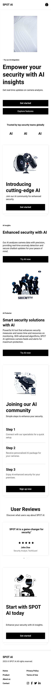
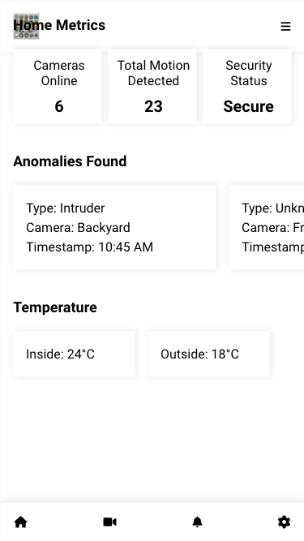
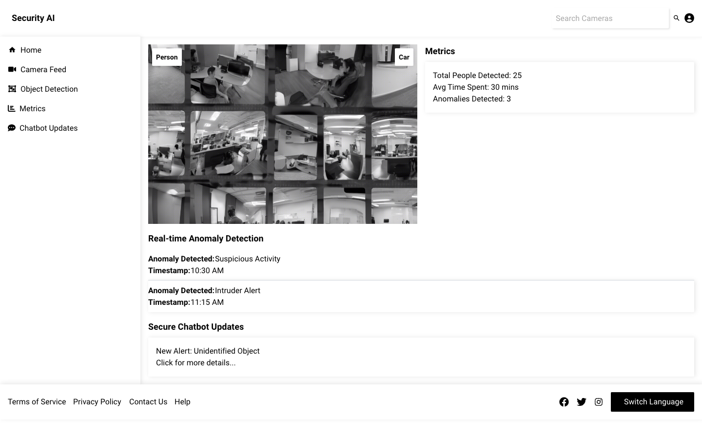
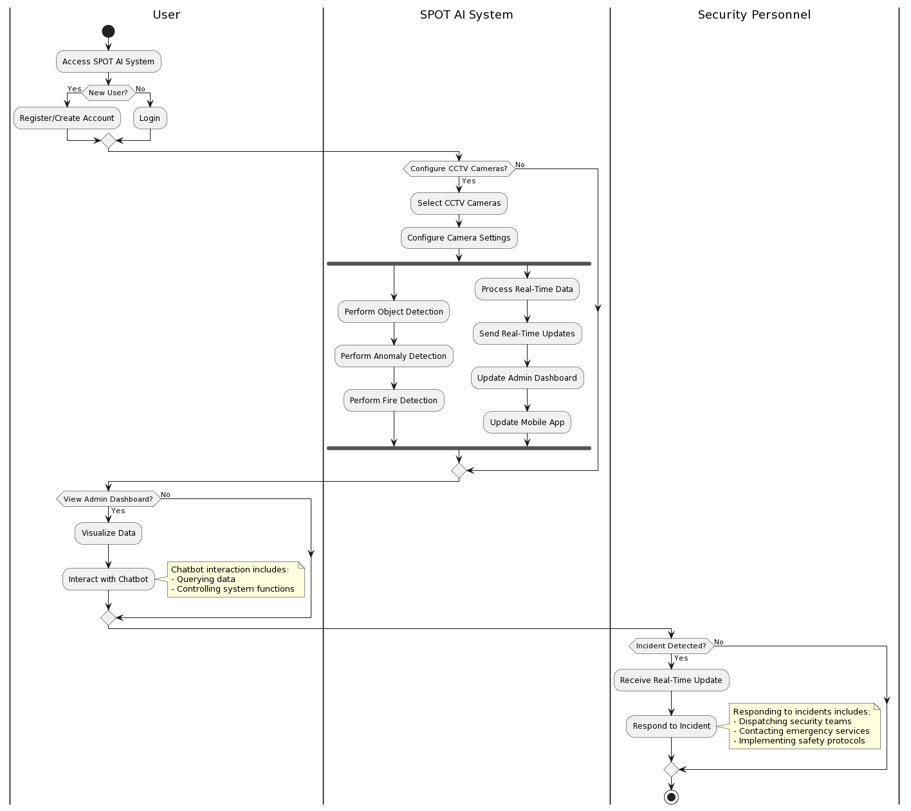
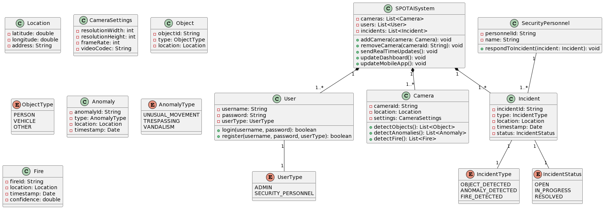

# MileStone 2

## Project Title

SuRक्षा - AI Powered Home Security and Surveillance System

## User Interface Design [prototype].

The goal of the user-centric SuRक्षा project is to improve user security and safety by utilizing their current security camera equipment. The project's design is founded on the concepts of User-Centered Design (UCD), which give the end-user's wants, preferences, and behaviors first priority throughout the development process. The following key factors demonstrate how SuRक्षा satisfies UCD requirements:

1. **User study and Understanding**: A great deal of study has been done to learn about the security apprehensions, problems, and expectations of the target users regarding such a system. This data is essential for determining SuRक्षा's features, operations, and user interface.

2. **Iterative Design method**: A constant method of gathering user feedback and integrating it into the design is used in the development of SuRक्षा. This methodology guarantees that the system develops according to real user requirements and preferences, as opposed to conjecture.

3. **Usability Testing**: To detect any usability problems, assess how intuitive the user interface is, and obtain input for enhancements, regular usability testing sessions are carried out with representative users. This guarantees a seamless user experience and makes SuRक्षा easy to use.

4. **Multi-platform Accessibility**: SuRक्षा accommodates customers' varied needs and preferences by providing a smartphone app for real-time updates and a web app for operating the cameras and a dashboard. This ensures accessibility across several platforms.

5. **Personalization and Customization**: Users can configure detection preferences, create custom alarms, and edit the user interface to suit their tastes by customizing and personalizing SuRक्षा to meet their unique needs.

6. **Easy and Seamless Integration**: SuRक्षा is made to work with consumers' current security camera configurations in an intuitive and seamless manner, reducing the need for complicated installs or extra hardware. This user-centric strategy improves the entire user experience and lowers adoption obstacles.

7. **Continual Improvement**: In order to make sure that SuRक्षा stays applicable, efficient, and user-friendly over time, it was designed with the idea of continual improvement. User feedback and developing technologies are incorporated into the system.

8. **Design Consistency**: To provide a seamless experience across different components, a unified design system is followed with consistent patterns for visuals, interactions and terminology.

9. **Accessibility and Inclusivity**: The design process actively considers accessibility needs for users with disabilities or impairments. This includes ensuring the user interfaces are compatible with assistive technologies and following web accessibility guidelines.

## Potential User Feedback

### Industry specialists

1. Shiv Prakash suman
   Senior System Analyst at Sopra Steria
   Email id- shiv.suman@soprasteria.com
   Mobile no. - +91 93119 52580

SuRक्षा offers a compelling solution for home security, yet privacy concerns must be addressed. Clear communication about data usage is essential. Nonetheless, it's a promising step towards safer homes through advanced technology.
Rating - 8/10

2. Somdutt Sharma
   Senior Consultant Cloud architect at HCLtech
   Email id- somya.fa@gmail.com
   Mobile no. - +91 97182 66745

SuRक्षा presents a smart solution for home security, though customizable features could enhance user experience. Nonetheless, its integration with emergency services adds significant value. Overall, a commendable effort towards safer homes.
Rating - 8/10

### Seniors

1. Swayam Rustagi
   E21CSEU0651
   Email id- e21cseu0651@bennett.edu.in
   Mobile no. - +91 95216 85236

SuRक्षा is an impressive project, leveraging AI for home security. Its swift threat detection and emergency service integration are commendable. However, ensuring robust data protection is vital for user trust. Overall, it's a promising step towards enhancing home safety.
Rating - 9/10

2. Abhay Jat
   E21CSEU0120
   Email id- e21cseu0120@bennett.edu.in
   Mobile no. - +91 89590 60040

The creative approach to home security taken by the SuRक्षा project is impressive. Staying ahead of dangers requires constant AI enhancement. All things considered, it's a noble effort to make homes safer.
Rating - 9/10

3. Ayush Ray
   M21BLAU0011
   Email id- m21Blau0011@bennett.edu.in
   Mobile no. - +91 97357 65446

The SuRक्षा initiative excels in utilizing AI for home security, especially with its emergency service integration. To improve, ensuring compatibility with diverse home setups is key. Nonetheless, it's a commendable effort towards making homes safer.

Rating - 8/10

### Normal 5 potential user feedback

1. Krish
   E22CSEU1481

I think SuRक्षा is really cool for home security. It's super quick at spotting threats and connecting with emergency services fast. But, they really need to make sure our data is safe so we can trust them more. Still, it's a great start to making homes safer.
Rating - 9/10

2. Satvik Batra
   E22CSEU1491

SuRक्षा is doing a great job with home security, especially with getting help quickly in emergencies. They just need to make sure it works with all kinds of homes. But overall, it's a good effort to make homes safer.
Rating -8/10

3. Anant Aggarwal
   E22CSEU1487

SuRक्षा has a really good idea for home security, but they need to be clear about how they use our data. It's important for privacy. Still, it's a good step towards safer homes with fancy technology.
Rating - 8/10

4. Pranav Anand
   E22CSEU1489

I'm impressed with how SuRक्षा is making home security fun and creative. They need to keep updating their AI to stay on top of things. But overall, it's a nice way to make homes safer.
Rating - 10/10

5. Harsh Chaudhary
   E22CSEU0911

SuRक्षा is a smart choice for home security, but it would be even better if we could customize it more. Still, it's great that it can call for help in an emergency. Overall, it's a good effort to keep homes safe.
Rating - 9/10

## Design Documents

- **Use Case Diagram**
  The primary features of the SuRक्षा system and user interactions are depicted in the use case diagram. The main player is the user, who has the ability to log in, set up CCTV cameras, access the admin dashboard, and use the mobile app.

  Use cases illustrate the main features of the system, such as object, anomaly, and fire detection; they also show how to receive real-time updates; interact with the chatbot; and visualize data.

  Associations and relationships are used to illustrate the relationships between the actors and use cases. The use cases for object detection, anomaly detection, fire detection, receiving real-time updates, interacting with a chatbot, and visualizing data, for instance, are included in the "View Admin Dashboard" and "View Mobile App" use cases.

  The "Receive Real-Time Updates" and "Respond to Incidents" use cases are linked to Security Personnel, another player in the diagram. The "Respond to Incidents" use case expands on the "Receive Real-Time Updates" use case by stating that reacting to events is an extension of getting real-time information.

- **Activity Diagram**
  The overall flow and exchanges between the user, the SuRक्षा system, and security staff are depicted in the activity diagram. Initially, the user needs to log in with their existing account or create a new one in order to use the system.

  The user chooses and configures the camera settings if they choose to configure CCTV cameras. At that point, the system simultaneously detects flames, anomalies, and objects. In addition, it provides updates, processes data in real time, and updates the admin dashboard and mobile app.

  In addition to performing administrative duties, the user can browse the admin dashboard to see data and communicate with the chatbot to question and control functionalities.

  Concurrently, security staff gets real-time updates in the event that an incident is discovered. After that, they can handle the situation by sending out teams, getting in touch with emergency services, or putting safety procedures in place.

  Using the fork notation, the diagram shows the parallel execution of individual tasks. It also includes supplementary annotations that explain particular actions or functionalities involved in particular steps.

- **Class Diagram**
  Users, cameras, and incidents are managed by the central `SuRक्षाSystem` class.

  Individual CCTV cameras are represented by the `Camera` class, which stores data about them such as location, settings, and camera ID. Its techniques for identifying items, irregularities, and fires allow the system to perform its essential surveillance functions.

  Users, including administrators and security staff, are represented by the `User` class, which has attributes defined by the `UserType` enumeration, such as credentials.

  The detected events, including the incident type ({IncidentType} enum), location, timestamp, and status ({IncidentStatus} enum), are encapsulated in the `Incident` class.

  The `SecurityPersonnel` class is used to represent employees who are in charge of reacting to situations in a specific way.

  The types ({ObjectType{ and {AnomalyType} enums), locations, and timestamps of detected entities are stored in supporting classes like {Object{, {Anomaly{, and `Fire}.

  Camera locations and setup settings are managed using classes such as `Location` and `CameraSettings`.

  The connections between classes show how different parts work together and rely on one another. For example, the composition connection between {SuRक्षाSystem} and {Camera} indicates that the system has more than one camera.

## Ethical and legal/privacy/terms and conditions

User privacy and moral behaviour are top priorities for SuRक्षा. By utilising our object detection software for commercial and residential security, you accept the following moral guidelines:

**Fair Use**: The goal of our programme is to improve safety and security. Users commit to using the programme in an ethical and responsible manner, abstaining from any harmful or unlawful activity.

**Non-discrimination**: No protected characteristic—including gender, race, ethnicity, or religion—is the basis for discrimination in our software. Users consent to refraining from using the software in any way that encourages bias or discrimination.¬¬

**Transparency**: We try our best to be forthright and honest about our product's limitations and features. Users agree to ask questions about any of the software's capabilities and to use it for the reasons for which it was intended.

**Accountability**: We are accountable for the moral application of our programme. Users consent to reporting to [Contact Information] any instances of software misuse or ethical issues.

### Terms, Privacy, Legal, and Conditions:

When using our object detection programme, you agree to the following terms and conditions:

**User Consent**: Users grant permission for the collection, use, and storage of their data as outlined in our privacy policy.

**Data Usage**: We may collect and use personal data to improve and provide our services. Users give their consent for these uses of their information.

**Security procedures**: We have put in place the necessary security procedures to protect user data. Users are aware that storing data electronically or transmitting it over the internet is never completely safe.

**Third-party Services**: Our programme may be able to communicate with third-party services or APIs.

Users confirm that they have read, understood, and agreed to abide by all of the terms and conditions stated here by accepting these terms and conditions.
Users who breach these terms and conditions or act unethically may have their access to the software terminated or suspended by SuRक्षा.

## Feasibility study/ Business Context

**Feasibility Study**:
The growing need for smart security solutions and developments in computer vision technology make our object detection software for residential and commercial security practical. We have evaluated the potential of our product through market research and feasibility studies. Our team has the machine learning and software development skills required to complete the project effectively.
Business Context of the Idea:
The rise in security concerns among homeowners and businesses presents a significant opportunity for our object detection software. Traditional security systems have limitations in detecting anomalies effectively, leading to increased demand for advanced solutions. By providing accurate and real-time anomaly detection, we aim to address this need and offer a comprehensive security solution.

**Monetization**:
We want to charge a subscription fee for our software, with tiers of pricing determined by the quantity of cameras and features needed. In order to include our software into their products, we might also look into collaborations or licensing arrangements with security system makers. Additionally, we can create an extra revenue stream by offering enterprise clients premium features or customization choices.

**Opportunity Analysis**:
With the worldwide smart security market expected to grow quickly in the upcoming years, there is a significant market opportunity for our object detection software. To safeguard their assets and houses, businesses and homeowners are spending more money on intelligent security systems. We can profit from this expanding market and position ourselves as an industry leader by providing a dependable and effective anomaly detection solution. Furthermore, our software is more effective because to developments in AI and machine learning, which appeals to more potential users.

## Project cost estimation

**Labor**:
Software Engineers (2): ₹ 35 Lakh/year/engineer _ 4 engineers _ 3 years = ₹ 4.2 Crore (1 Crore = 10 Million)
Data Scientists (1): ₹ 16Lakh/year _ 1 engineer _ 3 years = ₹ 48lakh
Project Manager: ₹ 50 Lakh/year \* 3 years = ₹1.5 Crore

**Hardware**:
Development Servers (2): ₹ 3.5 Lakh/server _ 2 _ 3 years = ₹ 21 Lakh
Testing Devices (Cameras, Sensors): ₹ 1.4 Lakh/device \* 10 devices = ₹ 14 Lakh (Cost may vary based on complexity)

**Software**:
Machine Learning Frameworks: ₹ 7 Lakh/year (subscriptions) _ 3 years = ₹ 21 Lakh
Cloud Storage: ₹ 3.5 Lakh/year _ 3 years = ₹ 10.5 Lakh (Cost may vary based on usage)

**Other Costs**:
Training Data Acquisition/Annotation: ₹ 14 Lakh (one-time cost)
Travel/Conferences: ₹ 3.5 Lakh/year \* 3 years = ₹ 10.5 Lakh

Minimum Estimated Cost: ₹ 7 Crore
Maximum Estimated Cost: This can vary depending on factors like:

- Team size and experience level
- Complexity of the system (features, accuracy requirements)
- Hardware/software choices
- Cloud usage

## Partial Implementation/ Draft Code

https://github.com/ChiragAgg5k/suraksha-ai

## Week wise Updates

### Week 1

- Our team will set up the project's development environment during the first week. As directed in the pyproject.toml file, two team members will start by installing Poetry, a dependency management tool for Python projects, and Python 3.11.
- They will install all of the dependencies—such as ultralytics, flask, torch, torchvision, and torchaudio—that are specified in the pyproject.toml file using Poetry.
- Following environment setup, each team member will become acquainted with the libraries being used and the project's structure.
- To learn more about the ultralytics library's features and how to incorporate it into our project, two additional team members will look through its examples and documentation.
- Furthermore, the initial two members of the team will investigate the possible applications and use cases of object detection and computer vision across a range of fields to aid in better defining the project's aims and objectives. In a project journal or notebook, we will record our ideas, conclusions, and any preliminary plans or thoughts.

### Week 2

- This week, we'll be concentrating on establishing the project's aims and objectives in light of the investigation and study completed last week.
- A pair of team members will ascertain the precise issue that needs to be resolved or the use case that needs to be addressed. For example, we could develop an application that can recognize and categorize objects in real-time video streams or analyze images for object recognition.
- Two additional team members will review the literature, look up current solutions or relevant fieldwork, and evaluate each one's advantages, disadvantages, and possible areas for development.
- All members of the team will work together to plan the project's architecture and high-level components, defining the key components, data flow, and interactions between various system components, based on this research.
- The team members will keep a project journal in which they will record our decisions, progress, and any issues or queries that come up during this week.

### Week 3

- This week, we'll start utilising the ultralytics library to implement the project's essential features. The first task for team members will be to configure and set up a development environment with all required dependencies.
- They will become acquainted with the various models that are available, as well as their individual advantages and disadvantages, by investigating the ultralytics library's object detection, tracking, and classification APIs and functionality.
- The core functionality will be implemented by the other two team members in accordance with the specifications of our project. This could entail importing pre-trained models, handling input data (pictures or videos), and extracting pertinent data like confidence scores, bounding boxes, and object classes.
- The team members will also create unit tests to verify that our implementation is correct. These tests will test different scenarios, edge cases, and input data to confirm functionality and spot any potential problems or bugs.
- In our project journal, we will record our advancement, obstacles faced, and significant choices or insights gained. We may also include brief segments of code, schematics, or pseudocode to demonstrate our methodology for implementation.

### Week 4

- This week, we'll use Flask to integrate the core functionality that was developed the week before with a web interface. Our web application's user interface (UI) will be designed and developed .
- It will take user experience into account and create user-friendly interfaces for uploading photos or videos, displaying processed results, and offering any necessary controls or settings.
- The other members of the team will put the backend logic into practice to manage user input, process the data using our fundamental features, and produce the necessary outputs or visualisations. The Flask application and the ultralytics library will be integrated so that there can be smooth communication between the two parts.The web interface will be thoroughly tested by the entire team to make sure it displays the desired outcomes and handles a variety of input scenarios.
- We will fix any bugs or usability problems found during testing and record the process of developing the web application, including the backend implementation, UI design, and any difficulties or lessons learned.

### Week 5

- We are going to add some more features to the web interface this week in order to improve our application's functionality and user experience. Real-time video streaming from cameras or other sources will be implemented by two team members, giving users the ability to feed live video and receive object detection and classification results in real-time.
- To guarantee a seamless and effective video transmission, they will investigate and put into practice suitable streaming protocols and strategies. The remaining two members of the team will work on interactive result visualisation, which will entail showing confidence scores, bounding boxes, and object labels right on the input images or video frames.
- They will investigate tools or methods for overlaying this data in a way that is clear and easy to use. A secure user authentication system will also be implemented by  members of the team utilizing industry-standard techniques like hashing and salting passwords or integrating with third-party authentication providers (like OAuth).
- We will record in our project diary the specifics of the implementation, the choices we made regarding the design, and any difficulties or lessons we ran across this week.

### Week 6

- Our team's main goal for this week is to thoroughly test our web application to make sure it works as intended and meets all project specifications. A thorough testing plan that includes user acceptability, performance, and functional testing
- . The team members will oversee functional testing, which entails confirming that all of our application's features and functionalities operate as intended. To cover a range of scenarios, including various input data types, edge cases, and error conditions, they will create test cases .
- We will test our application's performance, which will help us find and fix any bottlenecks or performance problems.
- We will measure metrics like response times, resource utilization, and scalability by simulating various load conditions using tools or techniques. Feedback from stakeholders or possible users will be gathered as part of the user acceptance testing process .
- The team members will assemble a representative sample of users and have them interact with our application in order to gather critical information about usability, user experience, and potential areas for improvement.
- We will document the entire testing process, including the test plan, test cases, and results. We will also log any issues or bugs discovered during testing, as well as any related solutions or workarounds.

### Week 7

- This week, our group will concentrate on enhancing the project's performance through the investigation of methods like GPU acceleration, parallelization, and model quantization.
- Model quantization techniques, which involve decreasing the accuracy of the weights and activations of the neural network model to produce smaller models and faster inference times, will be studied and put into practice by team members. we will look into methods such as post-training quantization or quantization-aware training.
- In order to maximizxwe the available hardware resources and expedite processing times, members will focus on parallelization, which involves splitting up the computational workload among several processors or cores.
- We will look into frameworks or libraries for parallel processing that we can incorporate into our project. The members of the team will also look into ways to use specialized hardware libraries like CUDA to take advantage of GPU acceleration, which can result in notable performance increases for computationally demanding tasks like object detection and image processing.
- We will record the optimization strategies we investigate, the implementation specifics, and the performance improvements attained, along with benchmarking data, code samples, and any lessons or difficulties we ran into.

### Week 8

- This week, our team will configure the required infrastructure and get our project ready for deployment.
- Two team members will investigate and assess various deployment options, taking into account aspects like cost, security, ease of management, and scalability. They will select the deployment platform that best fits the requirements of our project and is in line with the rules or preferences of our company.
- The other two team members are going to configure the deployment environment.The load balancers, databases, server instances, and other dependencies and services that are required for our application to run correctly will also be set up by them. They'll also automate deployment procedures using platforms like Docker or Kubernetes, which will make it possible to do repeatable and consistent deployments across different environments (including development, staging, and production).
- Any challenges or lessons learned during this phase will be recorded, along with the deployment process, the chosen infrastructure, and configuration standards. An updated deployment manual will be maintained by the members.

## Week Wise Plan

### Week 9

- Our team will deploy our project to the selected infrastructure this week and conduct a comprehensive deployment process test.
- The application will be deployed to the selected infrastructure, team  will be in charge of making sure it is usable and operating as intended in the production setting. End-to-end testing will be carried out to verify the complete application flow, from user input to result generation and display.
- A variety of scenarios, such as varied input data types, load conditions, and edge cases, will be tested. We will keep an eye on how well the application performs and how its resources are used in the live environment, looking for any possible problems or bottlenecks that might need to be fixed.
- We will keep a record of the deployment procedure, including any difficulties or problems that arise and the actions taken to fix them. The first two members of the team will add any new configurations or settings needed for the production environment, as well as deployment details, to our project documentation.

### Week 10

- This week, our group will test the product with potential users and stakeholders to get their input. A representative sample of users who meet our use case or target audience will be chosen by members, and we will be asked to engage with our deployed application.
- In order to gather information about the user experience, usability, and any areas that need improvement, they will create a user testing plan that details the testing objectives, scenarios, and feedback collection methods.
- They will take into consideration methods like surveys, interviews, or user observation. The  members of the team will examine the user testing and feedback received, looking for patterns, problems, or requests for new features.
- We will rank the feedback according to its significance and congruence with the aims and purposes of the project.
- The user testing procedure will be documented, along with the testing strategy, participant demographics, and feedback obtained. The main conclusions and suggestions for further enhancements or iterations will be summed up in this documentation.

### Week 11

- Our team will add any new features or make any necessary changes to our application to meet user expectations and improve its usability based on the feedback received from users during the previous week.
- Based on their significance and the amount of work needed to implement them, The team members will rank the feedback items in order of importance, giving special attention to pressing usability problems, performance snags, or features that are still lacking but have the potential to greatly improve the user experience.
- In order to make sure that the project documentation is accurate and up to date and appropriately represents the current state of our application.
- The development guidelines, API documentation, and user guides will be refined by the team members.
- We will keep a record of the adjustments and enhancements made this week, along with the particular feedback items addressed, the specifics of the implementation, and any difficulties or lessons learned.

### Week 12

- Our team will wrap up any loose ends and tasks in this week of the project. The project documentation will be carefully examined by team members to make sure it is complete and simple to understand for Users or future developers.
- We will draft an extensive project report that includes pertinent diagrams, code snippets, and performance benchmarks to bolster our conclusions and recommendations.
- The report will cover the project's goals, implementation specifics, difficulties encountered, and prospects for future improvement.
- The members will showcase our project to peers, stakeholders, or prospective users for assessment and comments. They should be ready to go over the project's advantages and disadvantages as well as the reasoning behind our design and implementation decisions.
- We will reflect on the entire project experience, highlighting key learnings, successes, and areas for personal growth or improvement, and we will document the project's final state, including any feedback or suggestions received during the presentation or evaluation phase.

## LinkedIn Post

https://www.linkedin.com/posts/chiragagg5k_artificialintelligence-surveillance-securitytech-activity-7175848431477788674-vf3M

## Patent Research

Given that our SuRक्षा research seems to incorporate unique and non-obvious technical breakthroughs, it can definitely qualify for a patent. We might be able to patent the combination of AI-powered object detection, anomaly detection, fire detection, real-time updates, and a chatbot interface for engaging with CCTV camera data.

We should perform a comprehensive prior art search before filing for a patent to make sure that our idea is actually original and has not been anticipated by already developed technology. To help our team navigate the patent application process, which usually entails producing a comprehensive specification, claims, and supporting documentation, we need to speak with a patent attorney or agent.

But it's important to remember that because software is abstract and AI technology is always changing, patenting software and AI-related ideas might be difficult. Our claims might be examined by the patent office to make sure they are not just abstract concepts or algorithms and that they fit the requirements for patentable subject matter.

We believe that our patent application could be strengthened if our invention includes particular technical advancements such new machine learning algorithms, data processing methods, or hardware integrations.

We may still take into account alternative types of intellectual property protection, such as copyrights for the software code or trade secrets for proprietary algorithms or data, even if our innovation is not patentable.
